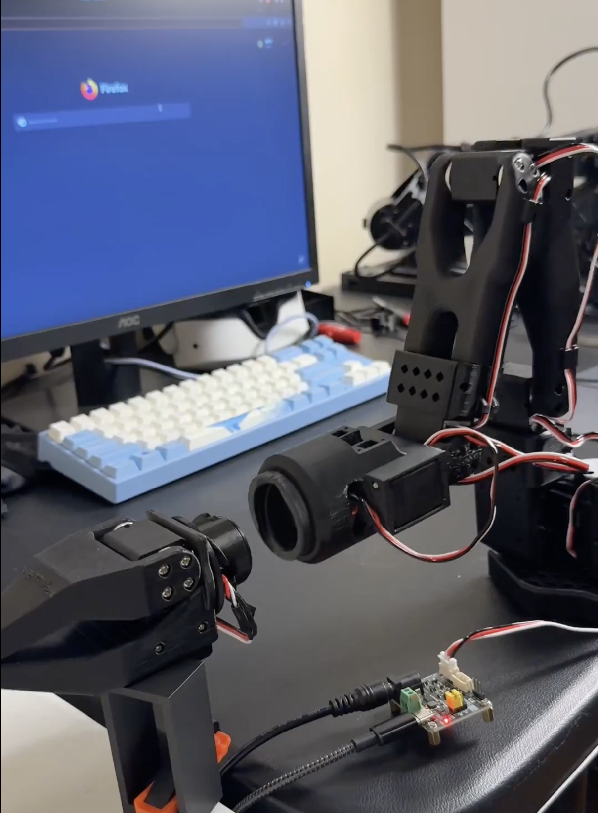

# Lattice Arm: Open Source Modular Detachable Low Cost Robotic Arm for Tool Use

[](LICENSE)
[](https://github.com/ahadjawaid/lerobot/tree/lattice)
[](https://twitter.com/ahadj0)



Lattice Arm is an open-source, low-cost robotic manipulator designed to be modular and detachable. This repo hosts the hardware design and build resources; pair it with [lerobot](https://github.com/ahadjawaid/lerobot/tree/lattice) on the `lattice` branch to teleoperate on the arm.

## News

- **2026-06-08** — Initial public release.

## BOM

The Lattice Arm reuses the SO-101 follower arm electronics and motors, so the bill of materials is split into the **Lattice** parts (unique to this repo) and the **SO-101 base arm** (the remaining standard parts). One full arm uses **6× Feetech STS 3215 servos** total — 2 in the Lattice upper section and 4 in the SO-101 base. Prices are in USD and referenced from the [SO-101 BOM](https://github.com/TheRobotStudio/SO-ARM100).

### Lattice

| Part | Qty | Unit Cost | Subtotal | Buy |
| --- | --- | --- | --- | --- |
| Feetech STS 3215 Servo 7.4V | 2 | $13.89 | $27.78 | [Seeed](https://www.seeedstudio.com/Feetech-ST-3215-C044-Heavy-Duty-Servo-7-4V-1-191-Gear-Reduction-p-6460.html) |
| 8 Pin Pogo Pin | 1 | $9.99 | $9.99 | [Amazon](https://www.amazon.com/dp/B0DT79W2VD) |
| PLA Filament — `lattice.3mf`, 189.11 g <sup>[1](#filament)</sup> | — | ~$20/kg | ~$3.78 | — |
| Jumper Wires M-M (optional) | 1 | ~$6.99 | — | [Amazon](https://www.amazon.com/dp/B07XJ97KD2) |
| **Total** | | | **~$41.55** | |

> [!NOTE]
> Screws for mounting the motors are included in the Feetech STS 3215 boxes. The optional jumper wires are excluded from the total.

### SO-101 Base Arm

| Part | Qty | Unit Cost | Subtotal | Buy |
| --- | --- | --- | --- | --- |
| Feetech STS 3215 Servo 7.4V | 4 | $13.89 | $55.56 | [Alibaba](https://www.alibaba.com/product-detail/Top-Seller-Low-Cost-Feetech-STS3215_1600999461525.html) |
| Motor Control Board | 1 | $10.60 | $10.60 | [Amazon](https://www.amazon.com/Waveshare-Integrates-Control-Circuit-Supports/dp/B0CTMM4LWK/) |
| USB-C Cable (2 pcs) | 1 | $7.00 | $7.00 | [Amazon](https://www.amazon.com/Charging-etguuds-Charger-Braided-Compatible/dp/B0B8NWLLW2/?th=1) |
| Power Supply | 1 | $10.00 | $10.00 | [Amazon](https://www.amazon.com/Facmogu-Switching-Transformer-Compatible-5-5x2-1mm/dp/B087LY41PV/) |
| Table Clamp (2 pcs) | 1 | $5.00 | $5.00 | [Amazon](https://www.amazon.com/Mr-Pen-Carpenter-Clamp-6inch/dp/B092L925J4/) |
| Screwdriver Set | 1 | $6.00 | $6.00 | [Amazon](https://www.amazon.com/Precision-Phillips-Screwdriver-Electronics-Computer/dp/B0DB227RTH) |
| PLA Filament — SO-101 base parts, 223.91 g <sup>[1](#filament)</sup> | — | ~$20/kg | ~$4.48 | — |
| **Total** | | | **~$98.64** | |

**Full arm total: ~$140.19** (Lattice ~$41.55 + SO-101 base ~$98.64), with **413.02 g** of filament.

<a name="filament">1</a>: Filament cost estimated at ~$20/kg PLA; adjust for your material and supplier.

## Instruction

See [`hardware/README.md`](hardware/README.md) for the print files, part list, and assembly.

## Simulation

A modular URDF model is available in [`simulation/`](simulation/). It includes a tool-less Lattice Arm base, attachable tool modules, generated `empty`, `gripper`, and `screw_gripper` variants, and an optional MuJoCo viewer for FK/IK inspection. See [`simulation/README.md`](simulation/README.md) for usage and validation.

## Contribution

Core contributors: **Ahad Jawaid** and **Juan Luna**.

Lattice is an active project and we welcome help. See [CONTRIBUTING.md](CONTRIBUTING.md) for the current roadmap and how to get involved.

## Citation

```bibtex
@misc{jawaid2026lattice,
    author = {Jawaid, Ahad and Luna, Juan},
    title = {Lattice Arm: Open Source Modular Detachable Low Cost Robotic Arm},
    howpublished = "\url{https://github.com/ahadjawaid/lattice}",
    year = {2026}
}
```

## Acknowledgement

Built on top of [SO-ARM100](https://github.com/TheRobotStudio/SO-ARM100) and [LeRobot](https://github.com/huggingface/lerobot). And repo inspired by [XLeRobot](https://github.com/Vector-Wangel/XLeRobot).

## Disclaimer

> [!NOTE]
> If you build, buy, or develop a Lattice Arm based on this repo, you will be fully responsible for all the physical and mental damages it does to you or others. No warranties or guarantees are made regarding safety, performance, or fitness for any particular use.
