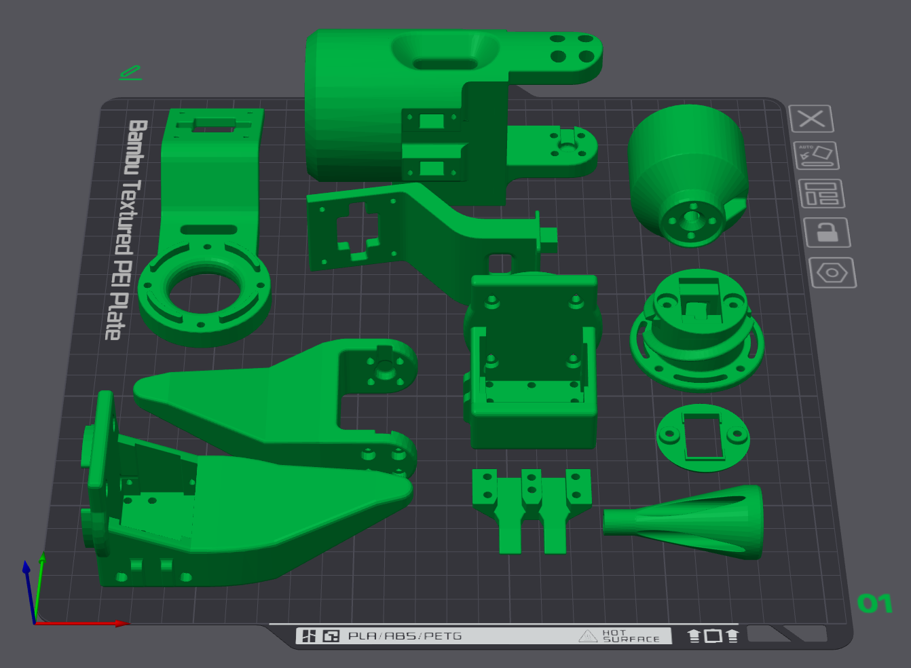
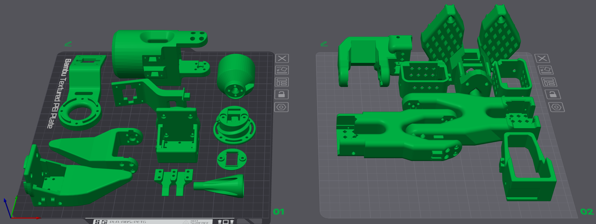
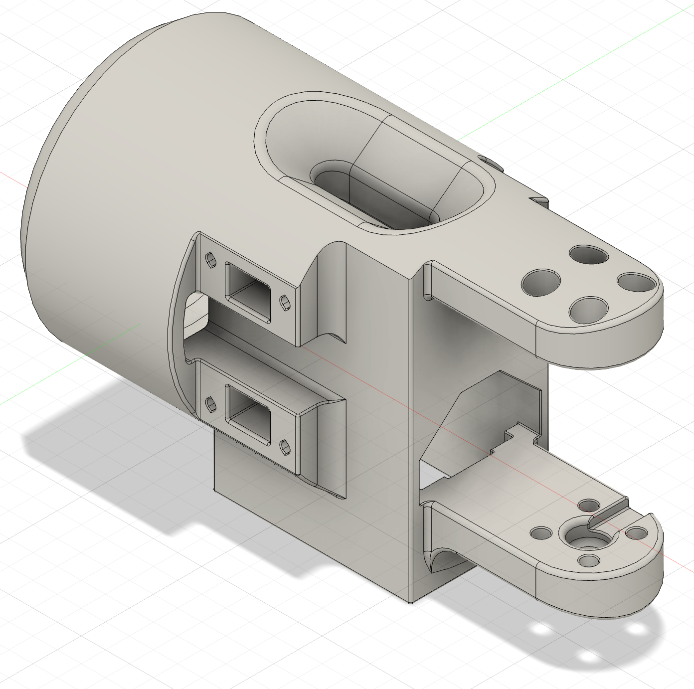

# Lattice Arm Hardware

The Lattice Arm is built on top of the [SO-101](https://github.com/TheRobotStudio/SO-ARM100) arm. This folder contains the 3D-printable parts, CAD source files, and assembly references for the Lattice-specific hardware — everything from the shoulder through the end effector and detachable connectors.

## 3MF Print Files

Two pre-arranged build plates are provided for Bambu Studio (or any slicer that supports `.3mf`).

### Lattice-only parts — `lattice.3mf`

Contains every part unique to the Lattice Arm: shoulder through end effector, including both detachable connectors. Use this if you already have SO-101 base-arm parts and only need to print the Lattice additions.



### Full arm — `lattice-full-arm.3mf`

Contains the complete arm on two plates: SO-101 base-arm parts (plate 01) and all Lattice-specific parts (plate 02). Use this for a from-scratch full-arm print.



| File | What it includes |
|------|------------------|
| [`lattice.3mf`](lattice.3mf) | Lattice-only parts (shoulder → connectors → gripper) |
| [`lattice-full-arm.3mf`](lattice-full-arm.3mf) | SO-101 base parts + all Lattice parts |

## Part Files

Each part folder contains a preview image (`.png`), a mesh for printing (`.stl`), and a CAD source file (`.step`) where available.

| Folder | Parts | Role |
|--------|-------|------|
| [`Shoulder/`](Shoulder/) | `Shoulder` | Shoulder housing — mounts to the SO-101 base arm |
| [`Shoulder Connector/`](Shoulder%20Connector/) | `ConnectorPartA`, `ConnectorPartAcap` | Detachable shoulder connector |
| [`End Effector Connector/`](End%20Effector%20Connector/) | `ConnectorPartB`, `ConnectorPartBcap` | Detachable wrist / end-effector connector |
| [`End Effectors/Gripper/`](End%20Effectors/Gripper/) | `GripperPartA`, `GripperPartb` | Default parallel-jaw gripper |
| [`End Effectors/Screw Gripper/`](End%20Effectors/Screw%20Gripper/) | `ScrewComponent`, `GeneralMotorCasing` | Alternate screw-driven gripper |
| [`CasingHolder/`](CasingHolder/) | `CasingHolder` | Motor casing mount |
| [`Camera Accessories/`](Camera%20Accessories/) | `CameraAttachment`, `CameraAttachment2` | Optional egocentric camera mounts |
| [`Lattice Arm/`](Lattice%20Arm/) | `lattice-arm` | Complete Lattice Arm assembly for CAD review and quick mesh viewing |

The Lattice Arm assembly files include SO-101 base-arm geometry from [SO-ARM100](https://github.com/TheRobotStudio/SO-ARM100) for full-arm context.

## Assembly

The Lattice upper arm attaches to the SO-101 base and is built in this order, base to tip:

```
SO-101 base arm  →  Shoulder  →  Shoulder Connector  →  End Effector Connector  →  Gripper
```

Each connector pair (`PartA` / `PartAcap`, `PartB` / `PartBcap`) forms a detachable joint so segments can be swapped without disassembling the full arm.

### 1. Shoulder

Mount the shoulder housing onto the SO-101 wrist/base-arm interface. The shoulder is the main structural block with side connector ports and a top cable-routing opening.



### 2. Shoulder Connector

Attach `ConnectorPartA` to the shoulder. Seat `ConnectorPartAcap` to complete the detachable shoulder joint. This is the first modular break point — the arm above the shoulder can be removed here.

| Body | Cap |
|------|-----|
|  |  |

### 3. End Effector Connector

Bolt `ConnectorPartB` to the output of the shoulder connector. Attach `ConnectorPartBcap` to form the second detachable joint at the wrist.

| Body | Cap |
|------|-----|
|  |  |

### 4. Gripper

Mount the gripper onto the end effector connector.

| Finger A | Finger B |
|----------|----------|
|  |  |

Install the gripper servo in [`CasingHolder/CasingHolder`](CasingHolder/CasingHolder.png) if using a dedicated motor housing.

## Optional Accessories

**Screw Gripper** — swap the default gripper for a lead-screw driven variant:

| Screw drive | Motor casing |
|-------------|--------------|
|  |  |

**Camera mounts** — attach egocentric cameras to the arm:

| Mount A | Mount B |
|---------|---------|
|  |  |

## Software

To teleoperat, use the [lerobot `lattice` branch](https://github.com/ahadjawaid/lerobot/tree/lattice).
